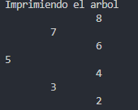
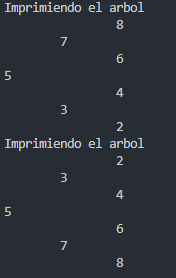

# Practica en Clases 2.2

## Datos del Estudiante
- **Nombre:** Gabriel Cuenca
- **Curso:** Grupo 3
- **Fecha:** 22/06/2026

---

# Ejercicio 1

```
public void insert(int[] numeros){
        BinaryTree<Integer> tree = new BinaryTree<>();

        for(int numero: numeros){
            tree.insert(numero);
        }

        printTree(tree.getRoot());
    }
```
El método `insert` crea un árbol binario vacío y le inserta todos los números del arreglo con el for each. Después de agregar todos los elementos, obtiene la raíz del árbol y llama a printTree para imprimir el arbol.

```
public void printTree(Node<Integer> root){
        System.out.println("Imprimiendo el arbol");
        printTreeRecursivo(root,0);
    }
```
El método `printTree` icia la impresión del árbol. Primero muestra el mensaje “Imprimiendo el arbol” y luego llama a printTreeRecursivo, enviando la raíz y el nivel 0.


```
private void printTreeRecursivo(Node<Integer> actual, int nivel) {
        if (actual == null)
            return;

        printTreeRecursivo(actual.getRight(), nivel + 1);

        for (int i = 0; i < nivel; i++) {
            System.out.print("\t");
        }
        System.out.println(actual.getValue());

        printTreeRecursivo(actual.getLeft(), nivel + 1);
    }
```

El método `printTreeRecursivo` imprime un árbol binario de forma recursiva usando el nivel para dar formato. Primero recorre el subárbol derecho, luego imprime el nodo actual con tabulaciones según su nivel, y finalmente recorre el subárbol izquierdo.


### Salida de consola:


# Ejercicio 2


```
public Node<Integer> invertTree(Node<Integer>root){

        invertRecursively(root);

        printTree(root);

        return root;
        

    }
```
El método `invertTree` invierte un árbol binario llamando a un método recursivo que intercambia sus ramas izquierda y derecha. Luego imprime el árbol invertido con `printTree` y luego devuelve la raíz del árbol ya modificado.

```
private void invertRecursively(Node<Integer> root){
        if(root == null){
            return;
        }

        Node<Integer> temp = root.getLeft();
        root.setLeft(root.getRight());
        root.setRight(temp);

        invertRecursively(root.getLeft());
        invertRecursively(root.getRight());
    }
```

El método `invertRecursively` invierte un árbol binario cambiando los hijos izquierdo y derecho de cada nodo. Si el nodo es null, termina el método. Si no, primero guarda el hijo izquierdo en una variable temporal temp, luego asigna el hijo derecho al lado izquierdo del nodo y después pone temp (el antiguo izquierdo) como hijo derecho.

Finalmente, llama recursivamente al mismo proceso en el hijo izquierdo y en el hijo derecho para invertir todo el árbol.


```
public void printTree(Node<Integer> root){
        System.out.println("Imprimiendo el arbol");
        printTreeRecursivo(root,0);
    }
```

El método `printTree` icia la impresión del árbol. Primero muestra el mensaje “Imprimiendo el arbol” y luego llama a printTreeRecursivo, enviando la raíz y el nivel 0.

```
private void printTreeRecursivo(Node<Integer> actual, int nivel) {
        if (actual == null)
            return;

        printTreeRecursivo(actual.getRight(), nivel + 1);

        for (int i = 0; i < nivel; i++) {
            System.out.print("\t");
        }
        System.out.println(actual.getValue());

        printTreeRecursivo(actual.getLeft(), nivel + 1);
    }
```
El método `printTreeRecursivo` imprime un árbol binario de forma recursiva usando el nivel para dar formato. Primero recorre el subárbol derecho, luego imprime el nodo actual con tabulaciones según su nivel, y finalmente recorre el subárbol izquierdo.

### Salida de consola:


